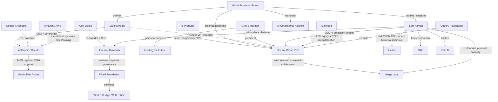

# tech-bro — AI power-network seed

**Dataset:** `tech-bro`  
**Pass:** 1  
**Date:** 2026-07-26  
**Schema:** StarIntel v0.9.0  
**Records:** 65

This seed maps documented links among OpenAI, Anthropic/Claude, selected peer AI labs, federal lobbying, political-advocacy organizations, World Economic Forum access, and Sam Altman's adjacent projects.

## Evidence model

Edges are typed by mechanism. This matters:

- `controls`, `holds_equity_in`, and `invested_in` describe governance or capital.
- `lobbying-filing` records describe filed federal lobbying activity.
- `donated_to` and `personally_supported` describe policy-advocacy funding.
- `profiles` and `participated_in_wef_session` describe institutional access or convening.
- WEF profiling or event participation is **not** encoded as ownership, command, or operational control.

Outside lobbying-firm income is not added to a client's self-reported lobbying expenses because doing so can double count the same activity.

## Core map

## Findings

### 1. OpenAI governance and capital

OpenAI's October 2025 structure places OpenAI Group PBC under OpenAI Foundation control. The Foundation appoints and can replace Group directors. At closing, the Foundation held 26% and Microsoft roughly 27%; employees and other investors held the remaining 47%.

### 2. Federal lobbying

OpenAI's self-filed expenses increased across the latest three captured quarters:

| Filing | Reported amount |
|---|---:|
| 2025 Q4 | $890,000 |
| 2026 Q1 | $1,020,000 |
| 2026 Q2 amended | $1,200,000 |

The filings cover AI, cloud/data-center infrastructure, cybersecurity, copyright and privacy, with contacts across Congress, the White House and executive agencies. Separate 2026 filings also list Akin Gump, DLA Piper and Miller Strategies working for OpenAI; those firm figures are retained as expansion targets rather than summed into the self-reported expense total.

Anthropic's 2025 Q1 self-filing reported $360,000, focused on the AI Diffusion Rule/export controls, AI reliability, infrastructure, national security and procurement. Ballard Partners' 2026 Q2 filing reported $380,000 for defense-procurement advocacy involving Congress, the White House, EOP and NSC.

### 3. Competing political-advocacy channels

OpenAI says it has no company super-PAC donations, employee-funded PAC, candidate donations or campaign donations. It separates Greg and Anna Brockman's personal support for Leading the Future from company action.

Reuters reported Anthropic announced a second $20 million donation to Public First Action in July 2026, bringing its reported 2026 support to $40 million. Public First Action advocates stronger AI-risk regulation and exists in opposition to the more deregulatory Leading the Future network.

### 4. WEF influence: what is actually documented

The evidence supports:

- WEF organization/person profiles for OpenAI, Sam Altman and Dario Amodei.
- Sam Altman's participation in a Davos 2024 AI session.
- WEF's launch of the AI Governance Alliance, designed to combine private-sector, government and civil-society actors around generative-AI governance.

The evidence in this pass does **not** establish WEF ownership or operational control of OpenAI or Anthropic. The graph therefore encodes WEF as a convening, access and agenda-setting layer.

### 5. Altman's adjacent project stack

The strongest documented cluster is not random. It maps to AI-system bottlenecks:

| Bottleneck | Project | Documented Altman link |
|---|---|---|
| Identity / proof of human | Tools for Humanity / World | TFH co-founder and chairman |
| Human–AI interface | Merge Labs | Co-founder in personal capacity; OpenAI seed investor |
| Fusion energy | Helion | Led $500M 2021 round; historical chairman/executive-chair statement |
| Fission energy | Oklo | Former chairman; stepped down April 22, 2025 |
| AI compute hardware | Rain AI | Listed backer |
| Consumer AI hardware/design | io Products | Collaboration with Jony Ive; io team merged into OpenAI |

World's official materials distinguish Tools for Humanity from World Foundation: TFH supplies software, hardware manufacturing and market-operations services, while the Foundation is separately governed and stewards the protocol.

### 6. Other AI nodes

This seed adds Anthropic/Claude, Google DeepMind and xAI as peer-lab nodes. Anthropic's capital and infrastructure dependencies are currently the most developed: Amazon announced major investment and AWS commitments, while Google announced multi-gigawatt TPU capacity. Google DeepMind and xAI are queued for a fuller lobbying, procurement, energy and policy comparison.

## Recursive targets

1. OpenAI Startup Fund governance and portfolio conflicts.
2. Apollo Projects and Altman-family investment vehicles.
3. Retro Biosciences financing and governance.
4. World regulatory actions, biometric-data enforcement and jurisdictional restrictions.
5. Complete WEF AI Governance Alliance membership, funders, working groups and policy outputs.
6. State-level AI lobbying and model-law networks.
7. xAI, Meta, Google DeepMind, Microsoft, Amazon and NVIDIA lobbying comparison.
8. Federal procurement, defense and intelligence contracts involving frontier-model firms.
9. Related-party transactions, recusals and independent-board approvals around OpenAI acquisitions and investments.
10. Lobbyist revolving-door histories for OpenAI and Anthropic firms.

## Primary sources

- [OpenAI — Our structure](https://openai.com/our-structure/)
- [OpenAI — Political advocacy statement](https://openai.com/index/our-views-on-ai-policy-and-political-advocacy/)
- [U.S. Senate LDA — OpenAI search](https://lda.senate.gov/filings/public/filing/search/?client=openai&search=search)
- [OpenAI 2025 Q4 LD-2](https://lda.senate.gov/filings/public/filing/8fd00332-8a97-439d-9348-bef9437f524d/print/)
- [OpenAI 2026 Q1 LD-2](https://lda.senate.gov/filings/public/filing/a8040c01-31bc-45c9-afb1-7ab54820ae32/print/)
- [Anthropic 2025 Q1 LD-2](https://lda.senate.gov/filings/public/filing/1fc93141-c0f8-4174-98dd-850afbed1b12/print/)
- [Ballard Partners / Anthropic 2026 Q2 LD-2](https://lda.senate.gov/filings/public/filing/8db3955e-600c-4e0a-8944-91a7878ae110/print/)
- [Anthropic–Amazon 2026 compute and investment agreement](https://www.anthropic.com/news/anthropic-amazon-compute)
- [Anthropic–Google/Broadcom 2026 compute agreement](https://www.anthropic.com/news/google-broadcom-partnership-compute)
- [WEF — AI Governance Alliance launch](https://www.weforum.org/press/2023/06/world-economic-forum-launches-ai-governance-alliance-focused-on-responsible-generative-ai/)
- [World — About and governance](https://world.org/about)
- [OpenAI — Investing in Merge Labs](https://openai.com/index/investing-in-merge-labs/)
- [Helion — 2021 $500M fundraise](https://www.helionenergy.com/blog/announcing-500-million-fundraise)
- [Oklo — Chairman transition](https://oklo.com/newsroom/news-details/2025/Oklo-Announces-Chairman-Transition/default.aspx)
- [Rain AI — About](https://rain.ai/about)
- [OpenAI — Sam and Jony / io](https://openai.com/sam-and-jony/)
- [Google DeepMind — About](https://deepmind.google/about/)
- [xAI — Company](https://x.ai/company)

## Secondary source

- [Reuters — Anthropic support for Public First Action](https://www.reuters.com/legal/government/anthropic-donate-20-million-us-political-group-that-supports-ai-regulation-2026-07-22/)
