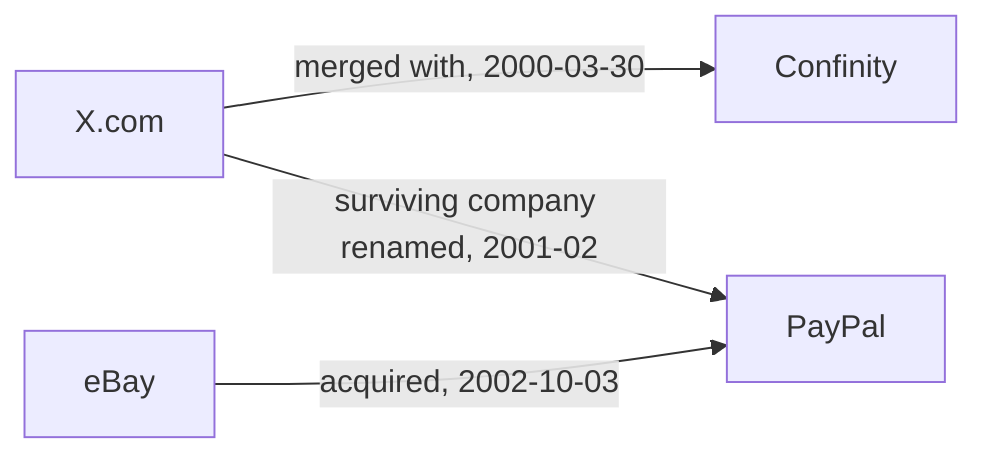
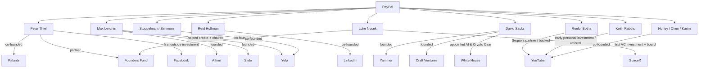

# tech-bro — PayPal Mafia network pass

**Dataset:** `tech-bro`  
**Run:** `tech-bro-paypal-mafia-2026-08-02`  
**Date:** 2026-08-02  
**Schema:** StarIntel v0.9.0  
**Records:** 124

This pass maps the early PayPal corporate lineage, the people commonly described as the “PayPal Mafia,” and the successor-company, venture-capital, board, and public-policy links that can be supported by primary or high-quality contemporaneous sources.

The supplied corkboard infographic was treated as a **lead map only**. It is not evidence. Its arrows mix incompatible mechanisms—employment, founding, investment, board service, and later firm affiliation—so this pass encodes each mechanism with a separate predicate.

## Record counts

| Type | Count |
|---|---:|
| `claim` | 4 |
| `org` | 24 |
| `person` | 16 |
| `relation` | 63 |
| `research-pass` | 1 |
| `source` | 16 |

## Core finding

The “PayPal Mafia” is not a formal organization. It is an informal alumni and capital network whose influence is visible through repeated, documented mechanisms:

1. **Shared operating history:** X.com and Confinity merged in March 2000; the surviving company became PayPal in February 2001.
2. **Liquidity event:** eBay completed the PayPal acquisition on October 3, 2002.
3. **Founder diaspora:** alumni founded or led LinkedIn, YouTube, Yelp, Palantir, SpaceX, Affirm, Yammer, Kiva, and major venture firms.
4. **Repeat trust and financing:** former PayPal CFO Roelof Botha backed the three PayPal alumni who founded YouTube; Luke Nosek carried the network into Founders Fund, Gigafund, and SpaceX; Peter Thiel financed multiple former colleagues.
5. **Policy bridge:** David Sacks's 2025 White House AI and Crypto Czar appointment connects a former PayPal operating executive directly to federal technology policy.

None of those paths, by itself, proves common control, conspiracy, or misconduct.

## Corporate origin



The SEC filing identifies X.com as the surviving corporation in the merger, records Peter Thiel and Max Levchin's Confinity leadership, and lists PayPal's senior officers immediately before the eBay acquisition.

## High-confidence network paths



## Infographic audit

| Graphic implication | Evidence-backed encoding |
|---|---|
| Peter Thiel → Stripe | Treat as an investment/portfolio question, not founding or employment. This pass does not add the edge without a transaction-level source. |
| Roelof Botha → YouTube | `led_venture_relationship_with`; he was not a YouTube co-founder. |
| Luke Nosek → SpaceX | `led_first_venture_investment_in` plus board service; he was not a SpaceX founder. |
| Max Levchin → Yelp | `helped_create_and_chair`; Yelp's co-founders were Jeremy Stoppelman and Russel Simmons. |
| Keith Rabois → Khosla Ventures | Current/later managing-director role; not his role at the time of the 2007 Fortune portrait. |
| Andrew McCormack → Valar | Later co-founder role, separate from his PayPal employment. |
| Dave McClure, Scott Banister, Yishan Wong, Jason Portnoy | Extended leads queued for primary-source verification; proximity in the chart is not treated as core membership evidence. |
| Missing Premal Shah | Added because Fortune's 2007 portrait included him and Kiva documents his PayPal-to-Kiva path. |

## Evidence classification

- **Primary:** SEC filings, eBay corporate reporting, White House records, company investor-relations biographies.
- **First-party history:** Founders Fund, Gigafund, Valar, Khosla Ventures, Greylock, Sequoia, Kiva.
- **Secondary:** Fortune's 2007 article is used to define the media label and portrait cohort, not to establish every corporate role.
- **Uploaded image:** lead generation only.

## Files

- `payload/starintel-documents.jsonl.gz.b64` — deterministic compressed payload containing 124 StarIntel v0.9.0 records.
- `build.py` — materializes and verifies `starintel-documents.jsonl`.
- `manifest.json` — counts, hashes, and endpoint validation.
- `research-queue.json` — unresolved extended nodes and depth-2 targets.

## Validation

- Unique IDs: **yes**
- All relation endpoints resolve inside this pass: **yes**
- All claim subjects resolve inside this pass: **yes**
- JSON round trip: **yes**
- Dataset field fixed to `tech-bro`: **yes**

## Next pass

The highest-value expansion is a transaction-grade capital map: SEC ownership filings, Form D records, board seats, financing rounds, fund portfolio links, political donations, lobbying records, and federal appointments. That will show where the alumni network is merely social and where it is reinforced by money, governance, or policy authority.

## Materialize

```bash
python3 build.py
```
