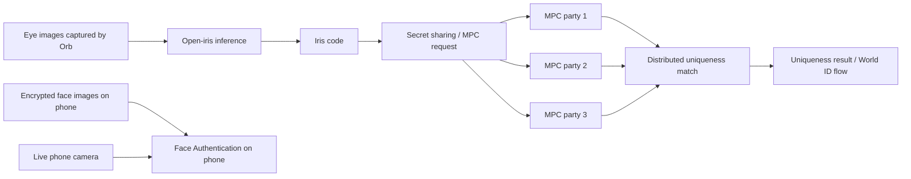

# WHO HOLDS THE BIOMETRIC MATCHING KEYS?

**Request:** #2095  
**Dataset:** `worldcoin`  
**Pass:** Orb / iris-MPC technical authority depth 1

World's current public technical stack is more specific than the usual “privacy-preserving” slogan.

The open `open-iris` pipeline turns iris imagery into iris codes. The public MPC uniqueness implementation compares those codes by calculating fractional Hamming distance without putting the complete matching input in one place. Current `iris-mpc` documentation describes a **three-party** architecture using a **semi-honest, honest-majority** security model: at most one of the three parties may be adversarial, and the model assumes two parties do not collude.

That matters. The privacy property is not “nobody has biometric-derived state.” It is that the matching state is split so one party should not hold the complete sensitive value under the stated assumptions.

## THE DATA FLOW

**Face Authentication is a different path.** World Help Center says the encrypted face images used for Face Authentication are stored on the user's phone and the comparison happens locally. TFH and World Foundation do not receive a copy of those images through that Face Authentication path.

Do not collapse that into the iris uniqueness system. Local face authentication and distributed iris matching solve different problems and have different custody surfaces.

## THE CONTROL GAP

The public repositories tell us the cryptographic model. They do **not**, in the sources reviewed in this pass, name every current production legal entity operating the three MPC parties.

That leaves the highest-value control questions unresolved:

- Who operates each production MPC party?
- Where are the parties hosted and under which jurisdictions?
- Who rotates certificates or replaces a party?
- Can one organization suspend or reconfigure the matching cluster?
- What contracts enforce operator independence and non-collusion?
- What persistence, backup, deletion, and disaster-recovery rules apply to secret-shared iris material?

The next recursive target is:

`starintel:investigation-target:worldcoin-iris-mpc-node-operators-depth-2`

## EVIDENCE BOUNDARY

Open-source architecture is not proof that production operators are organizationally independent. Likewise, the existence of secret-shared biometric-derived material is not proof that a single MPC party can reconstruct a usable iris template. Both overclaims are rejected.

## PRIMARY SOURCES

- World ID developer overview: https://docs.world.org/world-id/overview
- World `iris-mpc`: https://github.com/worldcoin/iris-mpc
- World MPC uniqueness check: https://github.com/worldcoin/mpc-uniqueness-check
- World `open-iris`: https://github.com/worldcoin/open-iris
- World ID protocol: https://github.com/worldcoin/world-id-protocol
- World Face Authentication documentation: https://support.world.org/hc/en-us/articles/31589092274195-What-is-Face-Authentication-and-how-does-it-work
