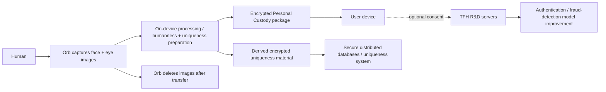

# INSIDE THE EYEBALL EMPIRE — control, tokens, and biometric custody

**Request:** #2095  
**Dataset:** `worldcoin`  
**Pass:** high-priority control / biometric / token baseline  
**Date:** 2026-08-20

This is the first focused transaction for request #2095. It reuses the existing `digs/tech-bro/2026-07-26-seed/` context instead of minting duplicate World / Tools for Humanity identities. The job here is narrower: separate the legal entities, identify the strongest documented control edges, and pin down what current first-party sources actually say happens to Orb data and WLD.

## THE SHORT VERSION

1. **World Foundation is not TFH.** Current World legal material describes World Foundation as a Cayman Islands exempted limited-guarantee foundation company. It is memberless, so there are no ordinary shareholders to point at and call “the owner.”
2. **The Foundation does directly control two important legal vehicles.** World Foundation is the sole member/shareholder and director of **World Assets Ltd.**, and the sole member and manager of **World Chain LLC**.
3. **World Assets is where 7.5 billion community WLD sit in the legal structure.** World’s tokenomics says World Assets is responsible for issuing the 75% community allocation, while the Foundation governs allocation of that community pool under its mandate.
4. **World Chain has a real operating company behind the decentralization language.** World describes World Chain LLC as responsible for ownership and operation of World Chain infrastructure. That does not tell us who holds every deployed admin key. That is the next technical-control target.
5. **Tools for Humanity remains a separate company with enormous practical influence.** World says TFH developed the Orb, initial protocol and World App, still operates World App, and provides software, hardware-manufacturing and market-operations services to the Foundation.
6. **Sam Altman’s exact current control is not yet proven.** The seed establishes the founder/chairman link. This pass did not recover a current TFH cap table, shareholder agreement, board voting matrix, or veto rights. Founder ≠ controller. We need the documents.
7. **The default Orb story is not “nothing leaves the device.”** Current World documentation says face/eye images are processed on the Orb, encrypted into a Personal Custody package, sent to the user’s phone, and deleted from the Orb. But World’s own Orb page separately says encrypted codes generated from the photos are stored across secure databases to prevent duplicate verification.
8. **There is also an optional TFH data path.** World Help Center documents an opt-in where Orb/authentication photos can be sent to TFH servers to train and improve World ID models. That is separate from default Personal Custody and must remain a separate evidence path.

## WHO OWNS WHAT?

```text
World Foundation (Cayman, memberless)
├── sole member/director → World Assets Ltd. (BVI)
│   └── issues 7.5B WLD allocated to the World Community
└── sole member/manager → World Chain LLC (Cayman)
    └── owns/operates World Chain infrastructure according to World

Tools for Humanity (Delaware)
├── separate from World Foundation
├── built Orb + first protocol implementation
├── operates World App
└── provides software / hardware / market-operations services to Foundation
```

This is the cleanest public legal/control map recovered in this slice. It does **not** prove who holds every technical admin key, who can replace every Foundation decisionmaker, or what Sam Altman can currently veto at TFH.

## FOLLOW THE MONEY

World’s current tokenomics keeps the initial WLD supply capped at **10 billion**. The public high-level allocation is:

| Pool | Share | Current public control description |
|---|---:|---|
| World Community | 75% | World Foundation governs allocation; World Assets Ltd. issues the 7.5B allocation |
| Initial development team | part of remaining 25% | TFH / contributors under published allocation and lock schedules |
| TFH investors | part of remaining 25% | Investor allocation with published unlock schedules |
| TFH reserve | part of remaining 25% | TFH reserve allocation |

The whitepaper also documents extensions to a large portion of TFH investor/team unlocks through 2028. That tells us **when tokens can unlock**, not which wallet belongs to which investor. Wallet attribution is a separate depth-1 target because making up treasury identities from vibes is how on-chain research turns into fan fiction.

## WHAT HAPPENS TO YOUR EYEBALL?



The key distinction is simple: **raw image custody, derived uniqueness material, authentication proofs, and optional model-training data are not the same thing.** Current World material says raw Orb images default to user custody and are deleted from the Orb. It also says derived encrypted codes are used in secure databases to prevent duplicate verification. Separately, users can opt in to send images to TFH for research/model improvement.

That means the public claim “World doesn’t store biometric images” cannot be used as a shortcut for “there is no off-device biometric-derived state.” Those are different claims.

## WHO HOLDS THE KEYS?

What we can establish now:

| System | Claimed/public governance | Documented legal operator/control | Still missing |
|---|---|---|---|
| World Community WLD allocation | Foundation-led, intended to decentralize over time | World Foundation + World Assets Ltd. | treasury wallets, allocation contracts, signing authority, grant/operator flows |
| World Chain | Optimism/Superchain-based World network | World Chain LLC owned/managed by Foundation | sequencer controls, upgrade proxies, multisigs, emergency roles, bridge authority |
| World ID / Orb ecosystem | Foundation stewardship + open protocol | TFH builds Orb and operates World App; Foundation receives TFH services | production admin keys, SMPC parties, exact uniqueness-state lifecycle, support/admin roles |

The next technical pass must inspect deployed contracts and repositories. Marketing copy cannot answer an admin-slot question.

## SAM ALTMAN: WHAT IS ACTUALLY PROVEN?

The existing StarIntel seed already records Altman’s founder/chairman relationship to Tools for Humanity. This pass adds **no new claim that he personally controls World Foundation, World Assets Ltd., or World Chain LLC**. Current World material explicitly separates TFH governance from World Foundation governance.

The unresolved question is sharper: **what TFH equity, board votes, protective provisions, or veto rights does Altman hold today?** Until primary corporate records answer that, “Sam owns World” is not an evidence-grade conclusion.

## NEXT RECURSIVE TARGETS

- `starintel:investigation-target:worldcoin-foundation-control-documents-depth-1`
- `starintel:investigation-target:worldcoin-orb-smpc-technical-authority-depth-1`
- `starintel:investigation-target:worldcoin-wld-allocation-wallets-depth-1`

These target the three gaps with the highest information value: legal control documents, biometric/SMPC authority, and attributable token flows.

## PRIMARY SOURCES

- World whitepaper tokenomics: https://whitepaper.world.org/designing-for-scale
- World Foundation User Terms v4.0: https://world.org/legal/user-terms-and-conditions/4.0
- World Foundation Privacy Notice v4.2: https://world.org/legal/privacy-notice
- Orb product/data-flow page: https://world.org/Orb
- World Privacy FAQs: https://world.org/blog/worldcoin/worldcoin-privacy-faqs
- Optional TFH data opt-in: https://support.world.org/hc/en-us/articles/40975077090835-How-can-I-opt-in-to-share-my-data-with-Tools-for-Humanity

## EVIDENCE BOUNDARY

This transaction does not claim that published decentralization goals have or have not been achieved. It records the legal and operational control statements World currently publishes, then queues direct contract, corporate-record and on-chain verification. It also does not attribute wallets, technical keys, or regulator findings without primary evidence.
